# [Essence Cuisine](https://essence-cuisine-7b8c204f88bc.herokuapp.com)


---

Essence Cuisine is a sophisticated and vibrant dining destination that embodies the true essence of gourmet dining. At the heart of our philosophy is the belief that food is not only a means to nourish but an experience that connects people, evokes emotions, and celebrates diverse culinary traditions. We offer an elevated dining experience where flavor, aesthetics, and culture come together harmoniously.

**Our Concept**

We specialize in dishes that are crafted with the finest ingredients, carefully curated for their freshness, quality, and sustainability. Our menu features a fusion of classic culinary techniques and modern twists, allowing us to offer unique, yet familiar flavors that cater to both adventurous food lovers and those seeking a more traditional experience. Each dish is thoughtfully prepared to showcase the natural flavors of the ingredients while adding a layer of complexity and balance.

**What we offer**

We offers a diverse range of dishes, drawing inspiration from global culinary traditions. From locally sourced, seasonal ingredients to exotic spices and international flavors, our menu offers a journey of taste that spans continents while maintaining a local connection. Whether you’re craving an indulgent starter, a beautifully crafted main course, or a decadent dessert, we aim to delight every palate.

## UX

### Color Scheme

- `#FFFFFF` used all throughout the site primarily on text elements.
- `#007bff` used for buttons through out the site.
- `#ffc107` used for reserve a table button.
- `#333333` used all throughout the site, mainly on text.
- `#dc3545` used for buttons.
- `#f4f4f4` used all throughout the site, it is the main background colour for the site.


I used [coolors.co](https://coolors.co/007bff-ffc107-ffffff-333333-dc3545-f4f4f4) to generate my colour palette.

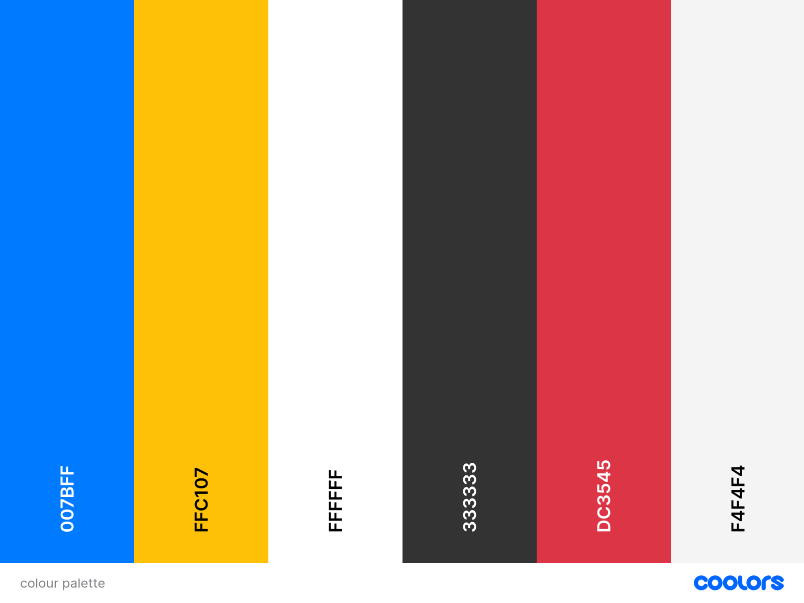

### Typography

- [Montserrat](https://fonts.google.com/specimen/Montserrat) was used through out the site.

- [Font Awesome](https://fontawesome.com) icons were used throughout the site, such as the social media icons in the footer.

## User Stories

### New Site Users

- As a new site user, I would like to **register for an account**, so that I can **make a reservation**.
- As a new site user, I would like to **view the list the menu**, so that I can **so that i know what to select**.

### Registered Site Users

- As a registered site user, I would like to **log in to my account**, so that I can **view my reservations**.
- As a registered site user, I would like to **book a reservation**, so that I can **so that i can reserve a table when i visit**.
- As a registered site user, I would like to **edit my reservation**, so that I can **change the date, time or number of guests**.
- As a registered site user, I would like to **cancel my reservation**, so that I can **free up space if my plans change and allow other users to book that time slot**.

### Site Admin

- As a site administrator, I should be able to **view all reservation**, so that I can **manage and monitor the schedule**.
- As a site administrator, I should be able to **add menu**, so that I can **user can view the menu**.

## Wireframes

| Page | Mobile | Desktop | 
| --- | --- | --- |
| Home | 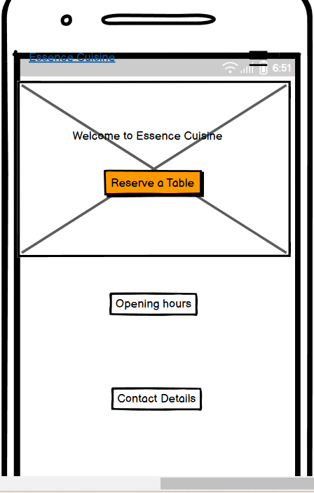 | 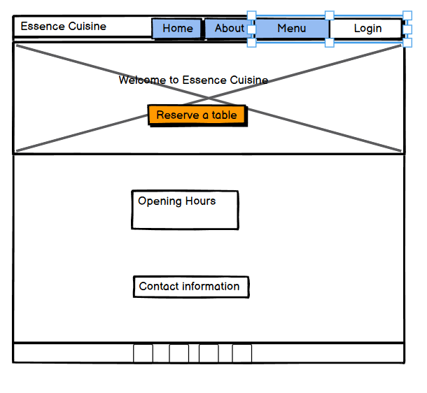 | 
| About |  | 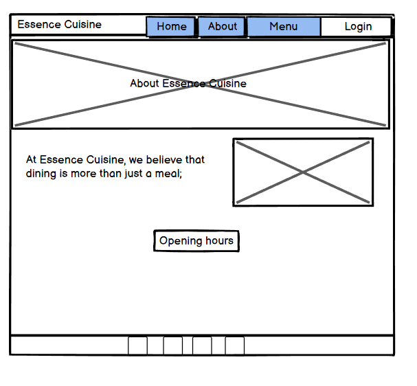 | 
| Menu | 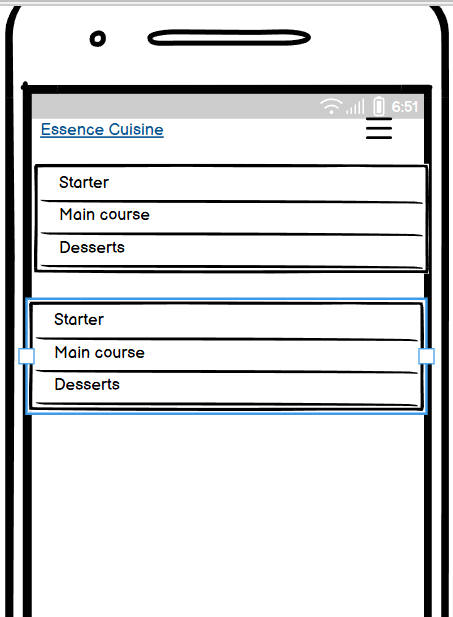 | 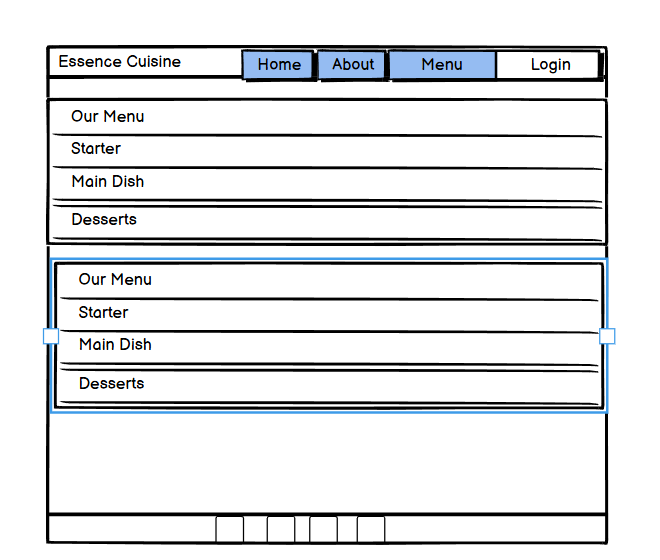 | 

## Features

There are many features on the website which are easy to follow and navigate, creating a nice user experience.

### Existing Features

#### Navbar, Footer & Sidebar

- **Navbar**: The navigation bar is prominently displayed on every page, improving the user experience by offering easy access to all sections of the website and boosting the visibility of important pages.


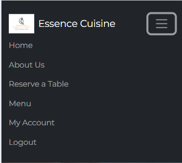

- **Sidebar**: Mobile users, will have access to the *sidebar*, this provides the same benefits as the navigation bar allowing users to easily access all pages of the site on mobile devices.

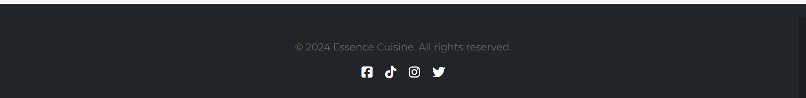

The footer, also featured on every page, includes social media links and copyright information. This enhances user engagement, promotes brand consistency, ensures legal compliance, and improves navigational accessibility.

#### Home Page

 - **Home Image**: The homepage features a captivating image of an elegant dining restaurant setting, effectively showcasing the ambiance and quality of Essence Cuisine's dining experience. This creates an immediate visual appeal and fosters trust with users.

 - **Welcome Message**: The welcome message, perfectly captures the essence of what your restaurant offers. It invites guests into a dining experience that is not only about taste but also about elegance and refinement. The phrase highlights the seamless blend of exceptional flavors and a sophisticated atmosphere, setting the tone for a memorable and upscale dining experience at Essence Cuisine.

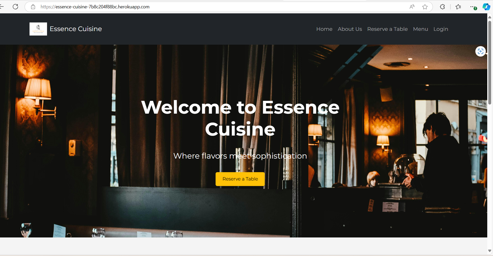

 - **Opening Hours**: Displaying opening hours helps create a smooth and hassle-free user experience, reducing the chances of frustration if a customer tries to visit outside of operating hours.
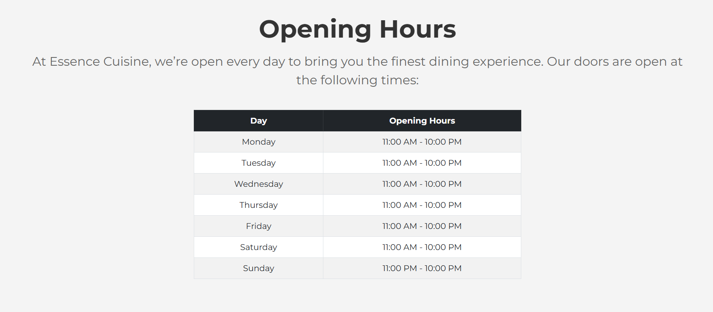

- **Contact Us**: The contact us section provides visitors with easy access to ways they can reach your restaurant, whether for making reservations, asking questions, or addressing concerns.
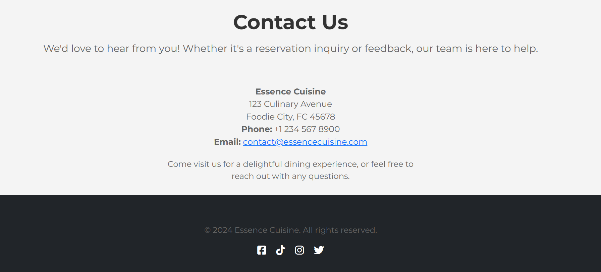

#### About Page

- **About Essence Cuisine**: This section highlight what makes shows the users what makes the restaurant stand out, it’s culinary expertise, focus on sustainability, and a commitment to exceptional customer service.
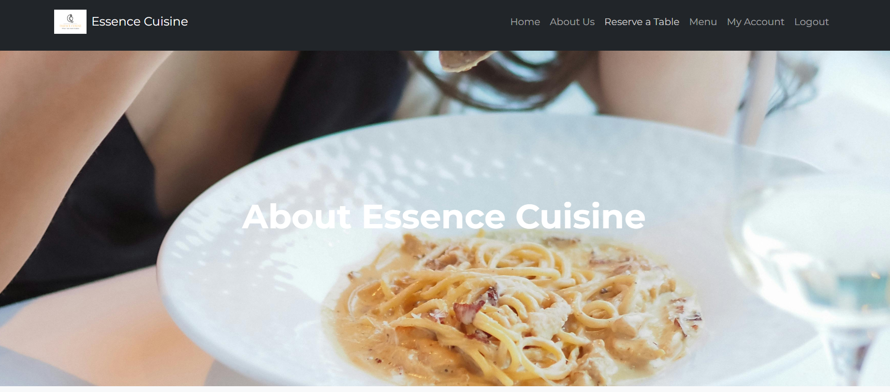
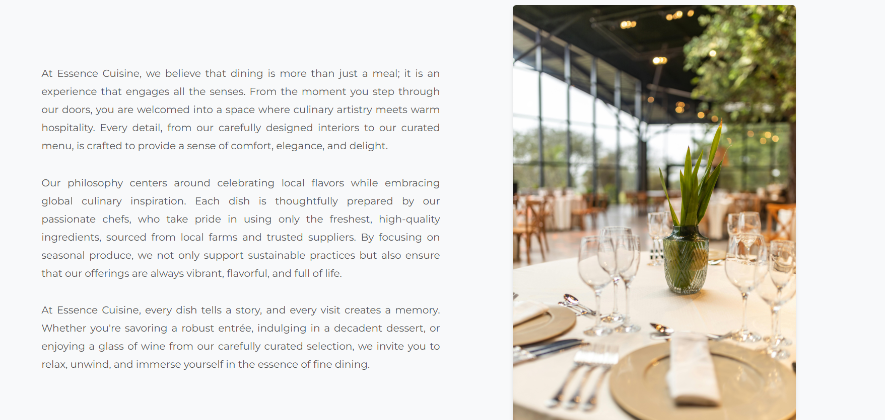

#### Reservations

- **Reserve a table**: The "Reserve a Table" link is featured on both the homepage section and the navigation bar, making it easily accessible. When a user clicks on the link, they are directed to log in or signup before reaching the booking page.
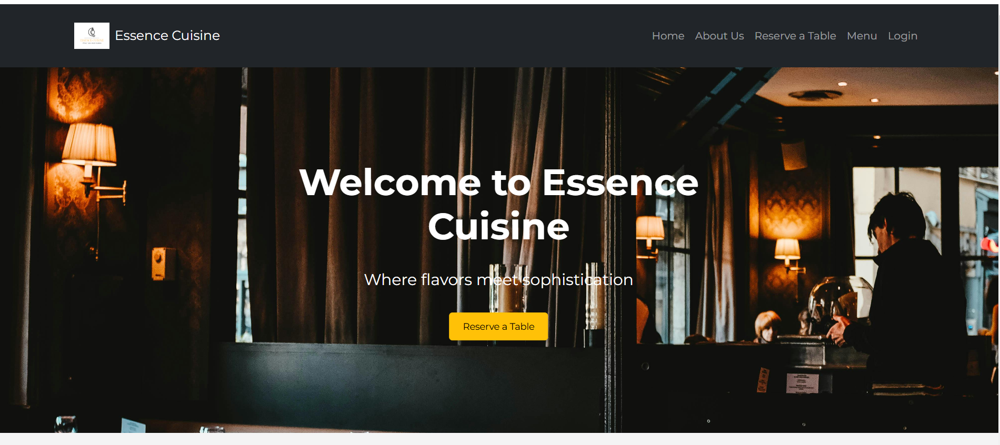
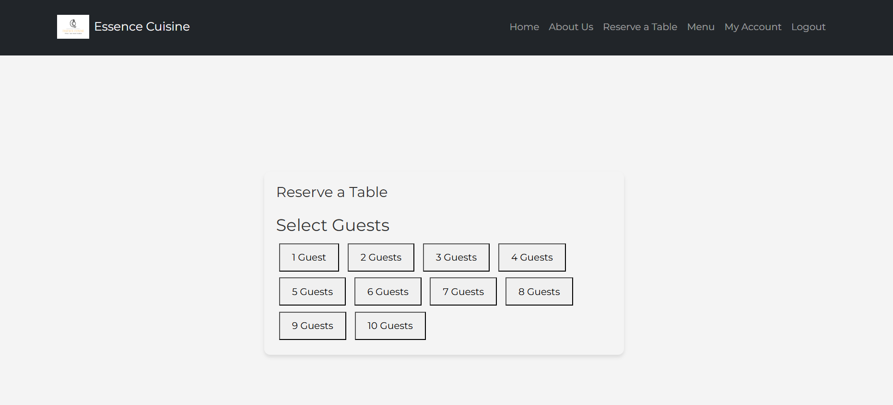

#### Signup/Login

- **Login**: The login page allows users to securely access their accounts by entering their username and password. after login in, the users can edit and cancel there reservation from the dashboard.

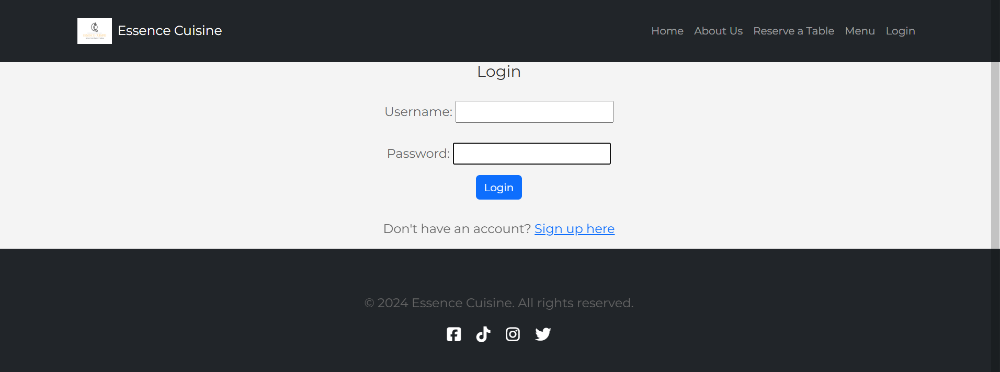
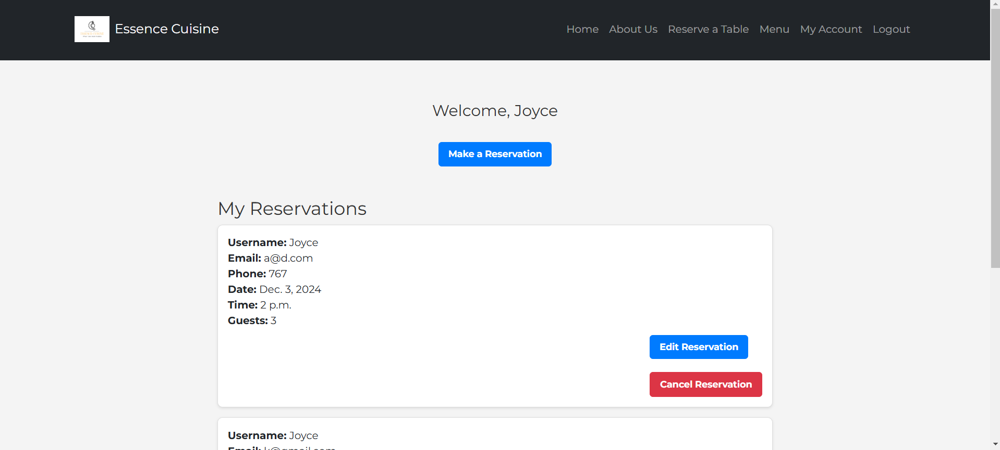

- **Sign Up**:

#### Reservations

- **Edit Reservation**: Users can edit their reservation here, allowing them to make adjustments to the date, time, and guest count. Whether plans change or preferences shift, this feature offers flexibility and convenience. By simply logging into their account, users can quickly modify their booking details and ensure everything aligns with their updated schedule. This seamless process enhances the overall customer experience, giving users more control over their dining plans while maintaining an easy-to-use interface.
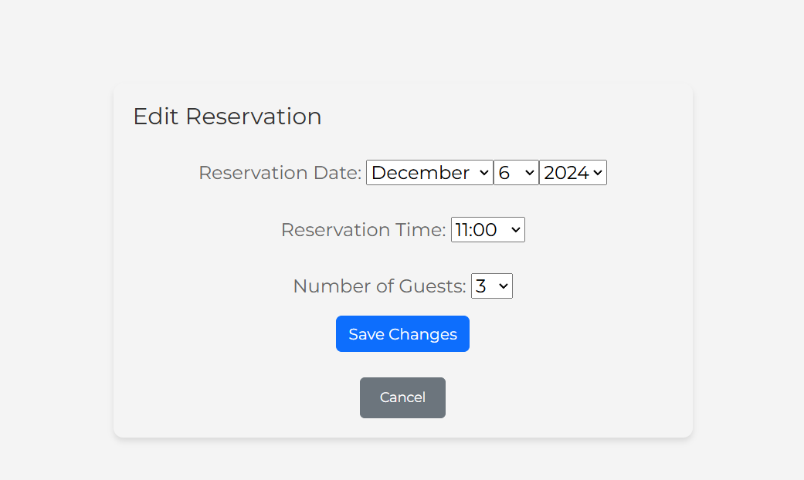

- **Cancel Reservation**: Users can cancel their reservation here, providing them with the flexibility to manage their plans effortlessly. If their schedule changes or they no longer need the reservation, they can easily cancel with just a few clicks. This feature ensures that users have control over their bookings and can adjust their dining plans accordingly. Additionally, canceling a reservation frees up space for other guests, ensuring that your restaurant can accommodate more customers. The process is simple and user-friendly, offering a hassle-free way for customers to manage their dining experience.
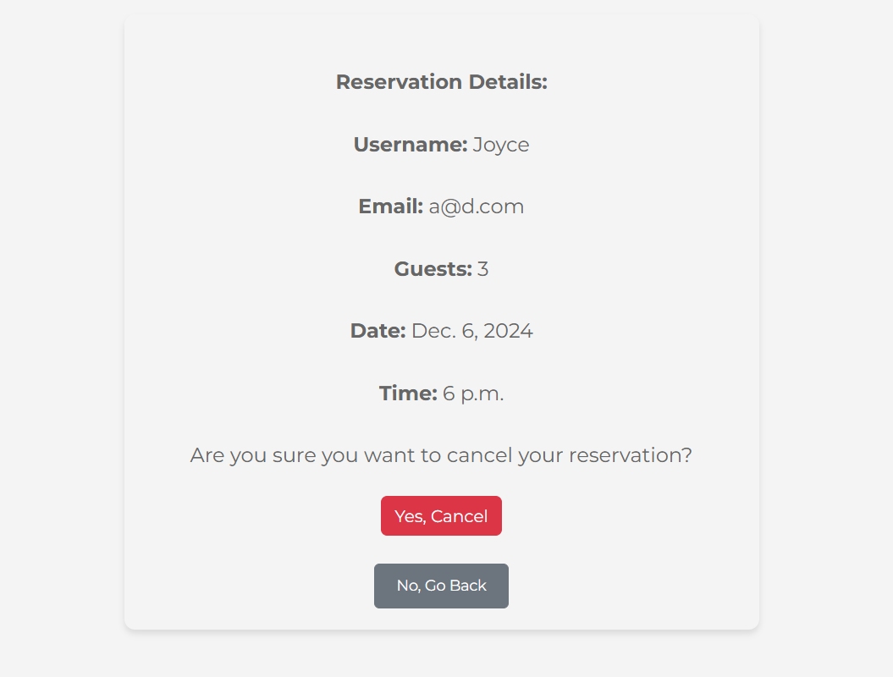

### Future Features

- **Online Payment Integration**: Allow users to pay for their reservations or pre-order meals directly through the website, adding convenience and reducing the need for transactions on-site.

- **Menu Customization**: Enable users to customize their meal choices, such as selecting ingredients, dietary preferences (vegan, gluten-free), or portion sizes directly from the menu.

## Tools & Technologies Used

- [](https://tim.2bn.dev/markdown-builder) used to generate README and TESTING templates.
- [](https://git-scm.com) used for version control. (`git add`, `git commit`, `git push`)
- [](https://github.com) used for secure online code storage.
- [](https://gitpod.io) used as a cloud-based IDE for development.
- [](https://en.wikipedia.org/wiki/HTML) used for the main site content.
- [](https://en.wikipedia.org/wiki/CSS) used for the main site design and layout.
- [](https://www.javascript.com) used for user interaction on the site.
- [](https://www.python.org) used as the back-end programming language.
- [](https://www.heroku.com) used for hosting the deployed   site.
- [](https://getbootstrap.com) used as the front-end CSS framework for modern responsiveness and pre-built components.
- [](https://www.djangoproject.com) used as the Python framework for the site.
- [](https://dbs.ci-dbs.net) used as the Postgres database from Code Institute.
- [](https://whitenoise.readthedocs.io) used for serving static files with Heroku.
- [](https://fontawesome.com) used for the icons.
- [](https://chat.openai.com) used to help debug, troubleshoot, and explain things.
- [](https://www.mermaidchart.com/) used for creating ERD diagrams.
- [](https://djecrety.ir/) tool used for generating django secret keys.
- [](https://balsamiq.com/) used to create wireframes in early development.

## Database Design

Entity Relationship Diagrams (ERDs) are valuable tools for visualizing the structure and relationships within a database before developing the models. By mapping out how different tables interact, ERDs provide a clear overview of the data flow and dependencies, which can streamline the design process. Understanding these connections early on helps identify potential issues, ensuring a more efficient development phase. Additionally, ERDs serve as a useful reference for future updates or modifications to the database, making it easier to maintain and scale the system as the project evolves.

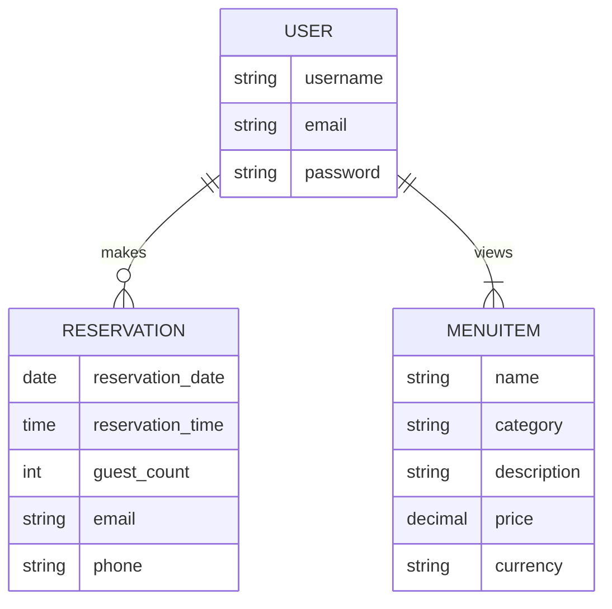
I have used [mermaidchart](https://www.mermaidchart.com/) to generate an ERD.

## Agile Development Process

### GitHub Projects

[GitHub Issues](https://github.com/users/jojoakh/projects/4) served as another Agile tool.
 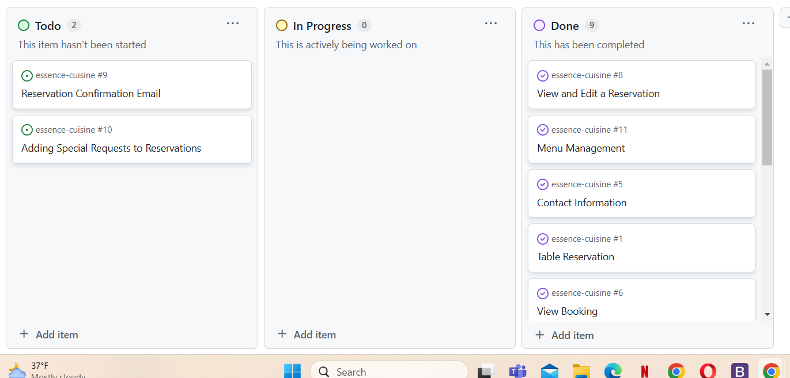

[Open Issues](https://github.com/jojoakh/essence-cuisine/issues?q=is%3Aopen+is%3Aissue) 
 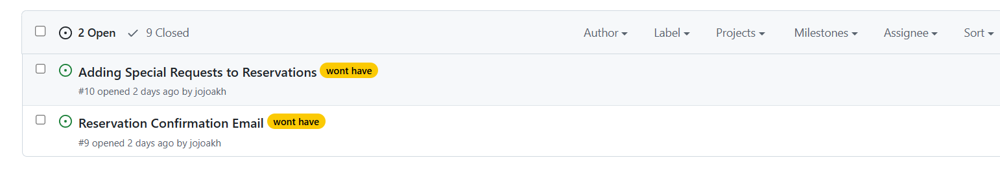

[Close Issues](https://github.com/jojoakh/essence-cuisine/issues?q=is%3Aissue+is%3Aclosed) 
 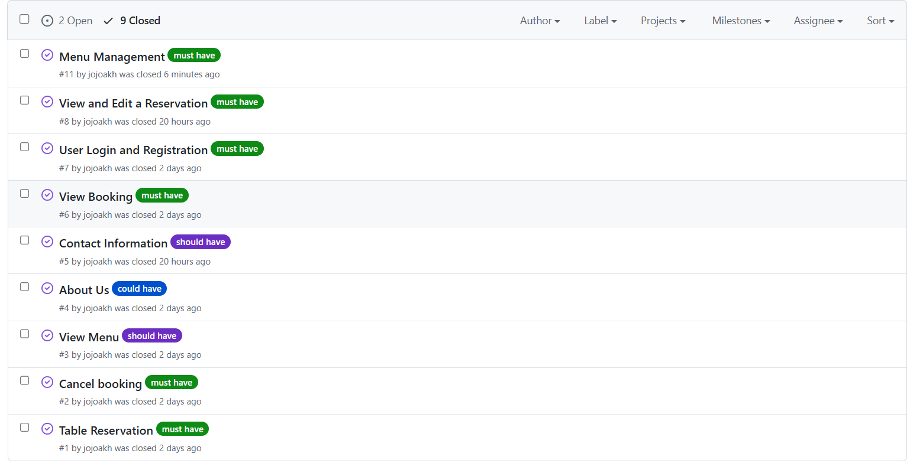

### MoSCoW Prioritization

I've decomposed my Epics into stories prior to prioritizing and implementing them.
Using this approach, I was able to apply the MoSCow prioritization and labels to my user stories within the Issues tab.

- **Must Have**: guaranteed to be delivered (*max 60% of stories*)
- **Should Have**: adds significant value, but not vital (*the rest ~20% of stories*)
- **Could Have**: has small impact if left out (*20% of stories*)
- **Won't Have**: not a priority for this iteration

## Testing

> [!NOTE]  
> For all testing, please refer to the [TESTING.md](TESTING.md) file.

## Deployment

The live deployed application can be found deployed on [Heroku](https://woof-wash-grooming-b7fa1160192f.herokuapp.com/).

### PostgreSQL Database

This project uses a [Code Institute PostgreSQL Database](https://dbs.ci-dbs.net).

To obtain my own Postgres Database from Code Institute, I followed these steps:

- Signed in to the CI LMS using my email address.
- An email was sent to me with my new Postgres Database.

> [!CAUTION]  
> - PostgreSQL database's by Code Institute are only available to CI Students.
> - You must acquire your own PostgreSQL database through some other method
> if you plan to clone/fork this repository.
> - Code Institute students are allowed a maximum of 8 databases.
> - Databases are subject to deletion after 18 months

### Cloudinary API

 [Cloudinary API](https://cloudinary.com) stores media assets online, due to the fact that Heroku doesn't persist this type of data.

To obtain your own Cloudinary API key, create an account and log in.

- For *Primary interest*, you can choose *Programmable Media for image and video API*.
- Optional: *edit your assigned cloud name to something more memorable*.
- On your Cloudinary Dashboard, you can copy your **API Environment Variable**.
- Be sure to remove the `CLOUDINARY_URL=` as part of the API **value**; this is the **key**.

### Heroku Deployment

This project uses [Heroku](https://www.heroku.com), a platform as a service (PaaS) that enables developers to build, run, and operate applications entirely in the cloud.

Deployment steps are as follows, after account setup:

- Select **New** in the top-right corner of your Heroku Dashboard, and select **Create new app** from the dropdown menu.
- Your app name must be unique, and then choose a region closest to you (EU or USA), and finally, select **Create App**.
- From the new app **Settings**, click **Reveal Config Vars**, and set your environment variables.

> [!IMPORTANT]  
> This is a sample only; you would replace the values with your own if cloning/forking my repository.

| Key | Value |
| --- | --- |
| `CLOUDINARY_URL` | user's own value |
| `DATABASE_URL` | user's own value |
| `DISABLE_COLLECTSTATIC` | 1 (*this is temporary, and can be removed for the final deployment*) |
| `SECRET_KEY` | user's own value |

Heroku needs three additional files in order to deploy properly.

- requirements.txt
- Procfile
- runtime.txt

You can install this project's **requirements** (where applicable) using:

- `pip3 install -r requirements.txt`

If you have your own packages that have been installed, then the requirements file needs updated using:

- `pip3 freeze --local > requirements.txt`

The **Procfile** can be created with the following command:

- `echo web: gunicorn app_name.wsgi > Procfile`
- *replace **app_name** with the name of your primary Django app name; the folder where settings.py is located*

The **runtime.txt** file needs to know which Python version you're using:
1. type: `python3 --version` in the terminal.
2. in the **runtime.txt** file, add your Python version:
	- `python-3.9.18`

For Heroku deployment, follow these steps to connect your own GitHub repository to the newly created app:

Either:

- Select **Automatic Deployment** from the Heroku app.

Or:

- In the Terminal/CLI, connect to Heroku using this command: `heroku login -i`
- Set the remote for Heroku: `heroku git:remote -a app_name` (replace *app_name* with your app name)
- After performing the standard Git `add`, `commit`, and `push` to GitHub, you can now type:
	- `git push heroku main`

The project should now be connected and deployed to Heroku!

### Local Deployment

This project can be cloned or forked in order to make a local copy on your own system.

For either method, you will need to install any applicable packages found within the *requirements.txt* file.

- `pip3 install -r requirements.txt`.

You will need to create a new file called `env.py` at the root-level,
and include the same environment variables listed above from the Heroku deployment steps.

> [!IMPORTANT]  
> This is a sample only; you would replace the values with your own if cloning/forking my repository.

Sample `env.py` file:

```python
import os

os.environ.setdefault("CLOUDINARY_URL", "user's own value")
os.environ.setdefault("DATABASE_URL", "user's own value")
os.environ.setdefault("SECRET_KEY", "user's own value")

# local environment only (do not include these in production/deployment!)
os.environ.setdefault("DEBUG", "True")
```

Once the project is cloned or forked, in order to run it locally, you'll need to follow these steps:

- Start the Django app: `python3 manage.py runserver`
- Stop the app once it's loaded: `CTRL+C` or `⌘+C` (Mac)
- Make any necessary migrations: `python3 manage.py makemigrations`
- Migrate the data to the database: `python3 manage.py migrate`
- Create a superuser: `python3 manage.py createsuperuser`
- Load fixtures (if applicable): `python3 manage.py loaddata file-name.json` (repeat for each file)
- Everything should be ready now, so run the Django app again: `python3 manage.py runserver`

#### Cloning

You can clone the repository by following these steps:

1. Go to the [GitHub repository](https://github.com/Jordan-Boulton1/woof-wash-grooming) 
2. Locate the Code button above the list of files and click it 
3. Select if you prefer to clone using HTTPS, SSH, or GitHub CLI and click the copy button to copy the URL to your clipboard
4. Open Git Bash or Terminal
5. Change the current working directory to the one where you want the cloned directory
6. In your IDE Terminal, type the following command to clone my repository:
	- `git clone https://github.com/Jordan-Boulton1/woof-wash-grooming.git`
7. Press Enter to create your local clone.

Alternatively, if using Gitpod, you can click below to create your own workspace using this repository.

[](https://gitpod.io/#https://github.com/Jordan-Boulton1/woof-wash-grooming)

Please note that in order to directly open the project in Gitpod, you need to have the browser extension installed.
A tutorial on how to do that can be found [here](https://www.gitpod.io/docs/configure/user-settings/browser-extension).

#### Forking

By forking the GitHub Repository, we make a copy of the original repository on our GitHub account to view and/or make changes without affecting the original owner's repository.
You can fork this repository by using the following steps:

1. Log in to GitHub and locate the [GitHub Repository](https://github.com/jojoakh/essence-cuisine)
2. At the top of the Repository (not top of page) just above the "Settings" Button on the menu, locate the "Fork" Button.
3. Once clicked, you should now have a copy of the original repository in your own GitHub account!

## Credits

### Content

| Source                                                                                                                            | Location    | Notes                                   |
|-----------------------------------------------------------------------------------------------------------------------------------|-------------|-----------------------------------------|
| [Markdown Builder](https://tim.2bn.dev/markdown-builder)                                                                          | README and TESTING | tool to help generate the Markdown files |
| [Bootstrap](https://getbootstrap.com/docs/5.3/components/navbar/)                                                                 | entire site | responsive HTML/CSS/JS navbar           |
| [Django Docs](https://docs.djangoproject.com/en/5.0/topics/auth/default/)                                                         | `models.py` `views.py` | user creation form                      |
| [Django Docs](https://docs.djangoproject.com/en/5.0/ref/forms/widgets/)                                                           | `forms.py`  | django widgets documentation            |
| [W3Schools](https://www.w3schools.com/cssref/sel_element_pluss.php)                                                               | style.css   | CSS element+element selector            |
| [WhiteNoise](http://whitenoise.evans.io)                                                                                          | entire site | hosting static files on Heroku temporarily |
| [GitHub Docs](https://docs.github.com/en/get-started/writing-on-github/working-with-advanced-formatting/creating-diagrams)        | readme      | implementing the ERD diagram            |


### Media

| Source | Location | Type | Notes |
| --- | --- | --- | --- |
| [Pexels](https://www.pexels.com/photo/woman-eating-spaghetti-10766722/) | about page | image | about essence |
| [Pexels](https://www.pexels.com/photo/crystal-vase-with-leaves-on-a-table-in-restaurant-17057009/) | about page | image | about page |
| [Pexels](https://www.pexels.com/photo/photo-of-tables-and-chairs-3534750/) | home | image | background |
| [Font Awesome](https://fontawesome.com/icons/tiktok?f=brands&s=solid) | footer | image | TikTok icon |
| [Font Awesome](https://fontawesome.com/icons/instagram?f=brands&s=solid) | footer | image | Instagram icon |
| [Font Awesome](https://fontawesome.com/icons/x-twitter?f=brands&s=solid) | footer | image | Twitter icon |
| [Font Awesome](https://fontawesome.com/icons/facebook?f=brands&s=solid) | footer | image | Facebook icon |

### Acknowledgement

- I would like to thank my lovely husband for being there all the time i needed his help and for supporting me to take this step into software development.
- I would like to thank the [Tutor Assistance](https://learn.codeinstitute.net/ci_support/diplomainfullstacksoftwarecommoncurriculum/tutor) for their help with debugging some project issues.