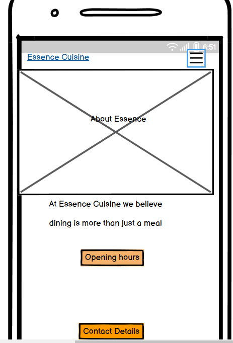
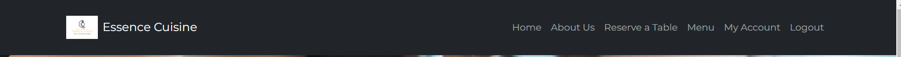

# [Essence Cuisine](https://essence-cuisine-7b8c204f88bc.herokuapp.com)

---

Essence Cuisine is a sophisticated and vibrant dining destination that embodies the true essence of gourmet dining. At the heart of our philosophy is the belief that food is not only a means to nourish but an experience that connects people, evokes emotions, and celebrates diverse culinary traditions. We offer an elevated dining experience where flavor, aesthetics, and culture come together harmoniously.

**Our Concept**

We specialize in dishes that are crafted with the finest ingredients, carefully curated for their freshness, quality, and sustainability. Our menu features a fusion of classic culinary techniques and modern twists, allowing us to offer unique, yet familiar flavors that cater to both adventurous food lovers and those seeking a more traditional experience. Each dish is thoughtfully prepared to showcase the natural flavors of the ingredients while adding a layer of complexity and balance.

**What we offer**

We offers a diverse range of dishes, drawing inspiration from global culinary traditions. From locally sourced, seasonal ingredients to exotic spices and international flavors, our menu offers a journey of taste that spans continents while maintaining a local connection. Whether you’re craving an indulgent starter, a beautifully crafted main course, or a decadent dessert, we aim to delight every palate.

## UX

### Color Scheme

- `#FFFFFF` used all throughout the site primarily on text elements.
- `#007bff` used for buttons through out the site.
- `#ffc107` used for reserve a table button.
- `#333333` used all throughout the site, mainly on text.
- `#dc3545` used for buttons.
- `#f4f4f4` used all throughout the site, it is the main background colour for the site.

I used [coolors.co](https://coolors.co/007bff-ffc107-ffffff-333333-dc3545-f4f4f4) to generate my colour palette.

### Typography

- [Montserrat](https://fonts.google.com/specimen/Montserrat) was used through out the site.

- [Font Awesome](https://fontawesome.com) icons were used throughout the site, such as the social media icons in the footer.

## User Stories

### New Site Users

- As a new site user, I would like to **register for an account**, so that I can **make a reservation**.
- As a new site user, I would like to **view the list the menu**, so that I can **so that i know what to select**.

### Registered Site Users

- As a registered site user, I would like to **log in to my account**, so that I can **view my reservations**.
- As a registered site user, I would like to **book a reservation**, so that I can **so that i can reserve a table when i visit**.
- As a registered site user, I would like to **edit my reservation**, so that I can **change the date, time or number of guests**.
- As a registered site user, I would like to **cancel my reservation**, so that I can **free up space if my plans change and allow other users to book that time slot**.

### Site Admin

- As a site administrator, I should be able to **view all reservation**, so that I can **manage and monitor the schedule**.
- As a site administrator, I should be able to **add menu**, so that I can **user can view the menu**.

## Wireframes

| Page | Mobile | Desktop | 
| --- | --- | --- |
| Home |  |  | 
| About |  |  | 
| Menu |  |  | 

## Features

There are many features on the website which are easy to follow and navigate, creating a nice user experience.

### Existing Features

#### Navbar, Footer & Sidebar

- **Navbar**: The navigation bar is prominently displayed on every page, improving the user experience by offering easy access to all sections of the website and boosting the visibility of important pages.

- **Sidebar**: Mobile users, will have access to the *sidebar*, this provides the same benefits as the navigation bar allowing users to easily access all pages of the site on mobile devices.

The footer, also featured on every page, includes social media links and copyright information. This enhances user engagement, promotes brand consistency, ensures legal compliance, and improves navigational accessibility.

#### Home Page

 - **Home Image**: The homepage features a captivating image of an elegant dining restaurant setting, effectively showcasing the ambiance and quality of Essence Cuisine's dining experience. This creates an immediate visual appeal and fosters trust with users.

 - **Welcome Message**: The welcome message, perfectly captures the essence of what your restaurant offers. It invites guests into a dining experience that is not only about taste but also about elegance and refinement. The phrase highlights the seamless blend of exceptional flavors and a sophisticated atmosphere, setting the tone for a memorable and upscale dining experience at Essence Cuisine.

 - **Opening Hours**: Displaying opening hours helps create a smooth and hassle-free user experience, reducing the chances of frustration if a customer tries to visit outside of operating hours.

- **Contact Us**: The contact us section provides visitors with easy access to ways they can reach your restaurant, whether for making reservations, asking questions, or addressing concerns.

#### About Page

- **About Essence Cuisine**: This section highlight what makes shows the users what makes the restaurant stand out, it’s culinary expertise, focus on sustainability, and a commitment to exceptional customer service.

#### Reservations

- **Reserve a table**: The "Reserve a Table" link is featured on both the homepage section and the navigation bar, making it easily accessible. When a user clicks on the link, they are directed to log in or signup before reaching the booking page.

#### Signup/Login

- **Login**: The login page allows users to securely access their accounts by entering their username and password. after login in, the users can edit and cancel there reservation from the dashboard.

- **Sign Up**:

#### Reservations

- **Edit Reservation**: Users can edit their reservation here, allowing them to make adjustments to the date, time, and guest count. Whether plans change or preferences shift, this feature offers flexibility and convenience. By simply logging into their account, users can quickly modify their booking details and ensure everything aligns with their updated schedule. This seamless process enhances the overall customer experience, giving users more control over their dining plans while maintaining an easy-to-use interface.

- **Cancel Reservation**: Users can cancel their reservation here, providing them with the flexibility to manage their plans effortlessly. If their schedule changes or they no longer need the reservation, they can easily cancel with just a few clicks. This feature ensures that users have control over their bookings and can adjust their dining plans accordingly. Additionally, canceling a reservation frees up space for other guests, ensuring that your restaurant can accommodate more customers. The process is simple and user-friendly, offering a hassle-free way for customers to manage their dining experience.

### Future Features

- **Online Payment Integration**: Allow users to pay for their reservations or pre-order meals directly through the website, adding convenience and reducing the need for transactions on-site.

- **Menu Customization**: Enable users to customize their meal choices, such as selecting ingredients, dietary preferences (vegan, gluten-free), or portion sizes directly from the menu.

## Tools & Technologies Used

-  used to generate README and TESTING templates.
-  used for version control. (`git add`, `git commit`, `git push`)
-  used for secure online code storage.
-  used as a cloud-based IDE for development.
-  used for the main site content.
-  used for the main site design and layout.
-  used for user interaction on the site.
-  used as the back-end programming language.
-  used for hosting the deployed   site.
-  used as the front-end CSS framework for modern responsiveness and pre-built components.
-  used as the Python framework for the site.
-  used as the Postgres database from Code Institute.
-  used for serving static files with Heroku.
-  used for the icons.
-  used to help debug, troubleshoot, and explain things.
-  used for creating ERD diagrams.
-  tool used for generating django secret keys.
-  used to create wireframes in early development.

## Database Design

Entity Relationship Diagrams (ERDs) are valuable tools for visualizing the structure and relationships within a database before developing the models. By mapping out how different tables interact, ERDs provide a clear overview of the data flow and dependencies, which can streamline the design process. Understanding these connections early on helps identify potential issues, ensuring a more efficient development phase. Additionally, ERDs serve as a useful reference for future updates or modifications to the database, making it easier to maintain and scale the system as the project evolves.

## Testing

> [!NOTE]  
> For all testing, please refer to the [TESTING.md](TESTING.md) file.