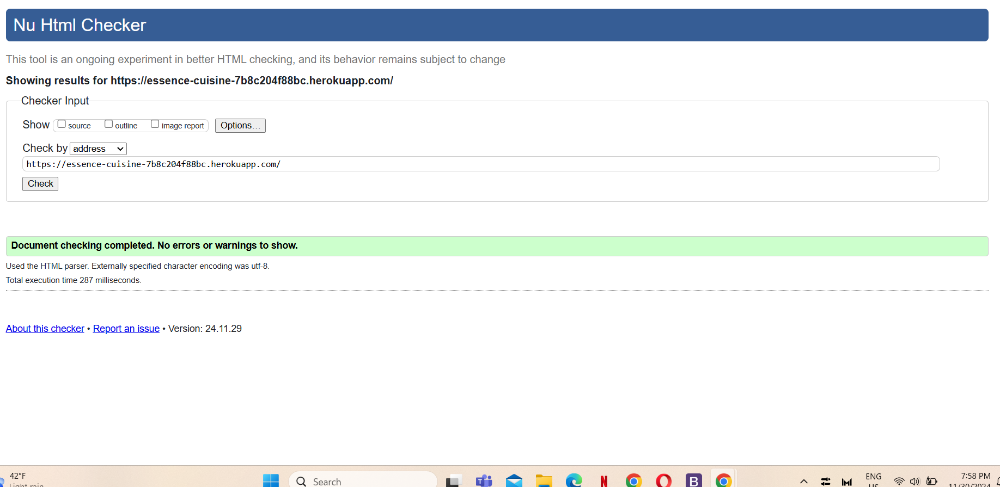
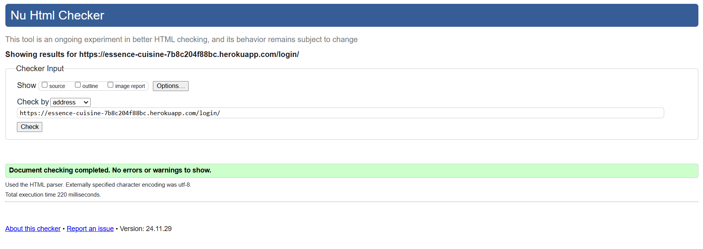
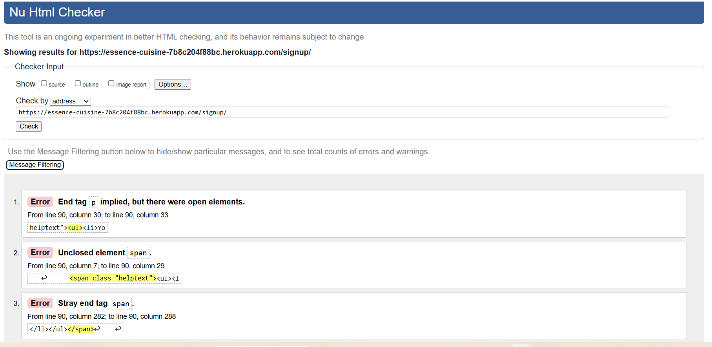
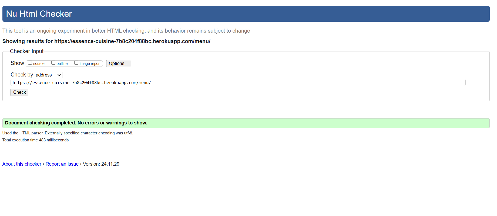
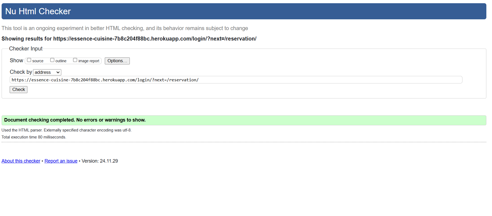
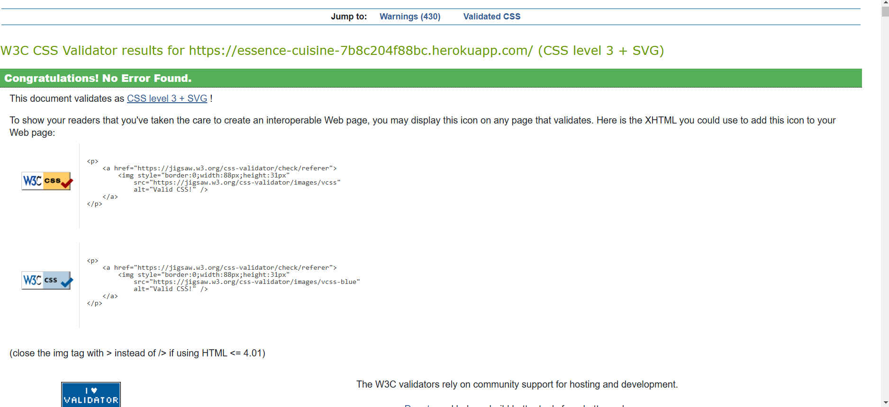
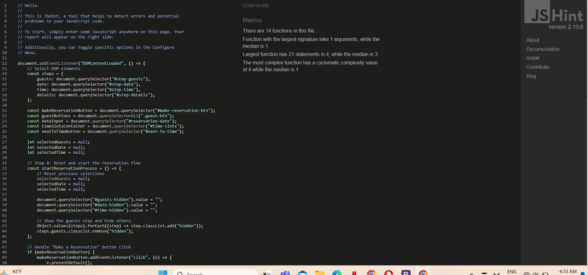
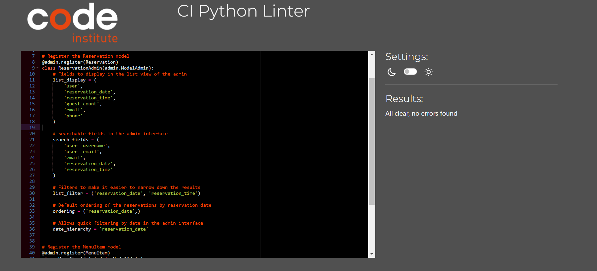

# Testing

> [!NOTE]  
> Return back to the [README.md](README.md) file.

## Code Validation

### HTML

I have used the recommended [HTML W3C Validator](https://validator.w3.org) to validate all of my HTML files.

| Page | screenshot | Notes |                                                                                                 |
| --- | --- | --- | ----------------------------------------------------------------------------------------------------------|
| Home |  | Pass: No Errors |
| Login |  | Pass: No Errors |
| Signup |  | I am aware of the errors on this page, the errors are are from the Django custom form |
| Menu |  | Pass: No Errors |
| Reservation |  | Pass: No Errors |

### CSS

I have used the recommended [CSS Jigsaw Validator](https://jigsaw.w3.org/css-validator) to validate all of my CSS files.

| Page | screenshot | Notes |                                                                                                 |
| --- | --- | --- | ----------------------------------------------------------------------------------------------------------|
| Style.css  |  |  Pass: No Errors |

### JavaScript

I have used the recommended [JShint Validator](https://jshint.com) to validate all of my JS files.

| Page | screenshot | Notes |                                                                                                 |
| --- | --- | --- | ----------------------------------------------------------------------------------------------------------|
| Reservation.js  |  |  Pass: No Errors |

### Python

I have used the recommended [PEP8 CI Python Linter](https://pep8ci.herokuapp.com) to validate all of my Python files.

| Page | screenshot | Notes |                                                                                                 |
| --- | --- | --- | ----------------------------------------------------------------------------------------------------------|
| Admin  |  |  Pass: No Errors |