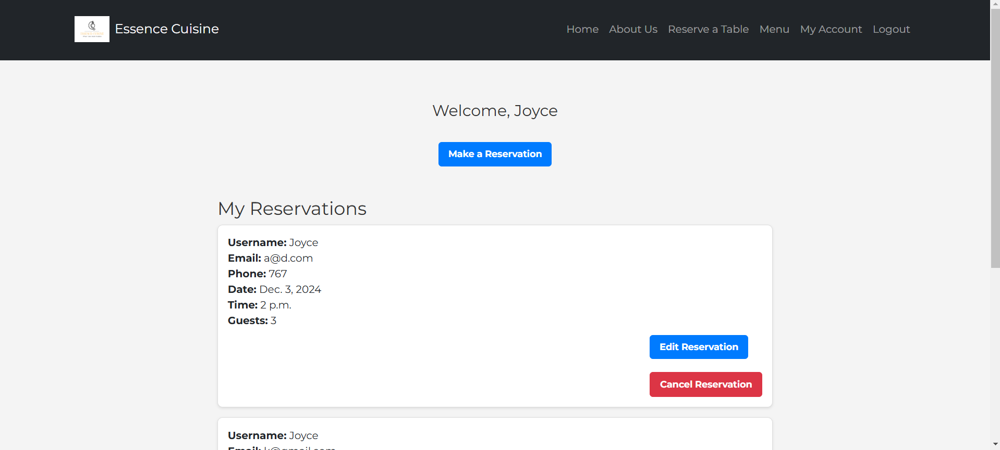
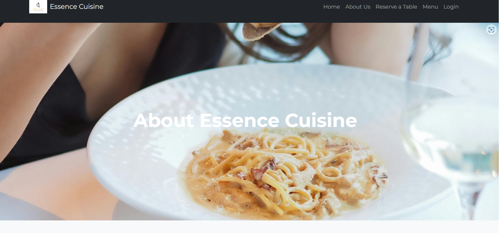
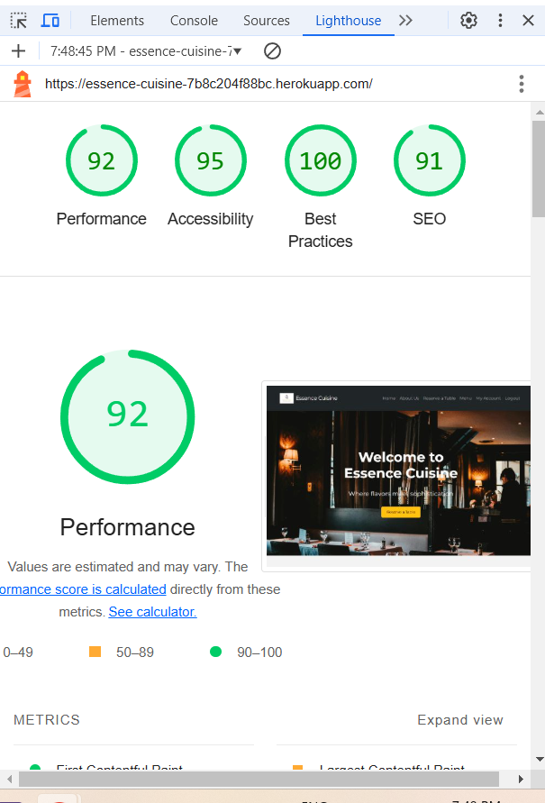
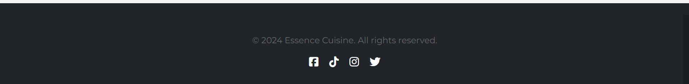

# Testing

> [!NOTE]  
> Return back to the [README.md](README.md) file.

## Code Validation

### HTML

I have used the recommended [HTML W3C Validator](https://validator.w3.org) to validate all of my HTML files.

| File | screenshot | Notes |                                                                                                 |
| --- | --- | --- | ----------------------------------------------------------------------------------------------------------|
| Home |  | Pass: No Errors |
| Login |  | Pass: No Errors |
| Signup |  | I am aware of the errors on this page, the errors are are from the Django custom form |
| Menu |  | Pass: No Errors |
| Reservation |  | Pass: No Errors |

### CSS

I have used the recommended [CSS Jigsaw Validator](https://jigsaw.w3.org/css-validator) to validate all of my CSS files.

| Page | screenshot | Notes |                                                                                                 |
| --- | --- | --- | ----------------------------------------------------------------------------------------------------------|
| Style.css  |  |  Pass: No Errors |

### JavaScript

I have used the recommended [JShint Validator](https://jshint.com) to validate all of my JS files.

| File | screenshot | Notes |                                                                                                 |
| --- | --- | --- | ----------------------------------------------------------------------------------------------------------|
| Reservation.js  |  |  Pass: No Errors |

### Python

I have used the recommended [PEP8 CI Python Linter](https://pep8ci.herokuapp.com) to validate all of my Python files.

| File | screenshot | Notes |                                                                                                 |
| --- | --- | --- | ----------------------------------------------------------------------------------------------------------|
| admin.py  |  |  Pass: No Errors |
| model.py  |  |  Pass: No Errors |
| views.py  |  |  Pass: No Errors |
| urls.py   |    |  Pass: No Errors |
| forms.py  |  |  Pass: No Errors |

## Browser Compatibility

I've tested my deployed project on multiple browsers to check for compatibility issues.

| Browser | Home | About | Booking | Menu | Account | Notes |
| --- | --- | --- | --- | --- | --- | --- |
| Chrome |  |  |  |   |  | Works as expected |
| Opera |  |  |  |   |  | Works as expected |
| Edge |  |  |  |   |  | Works as expected |

## Lighthouse Audit

I've tested my deployed project using the Lighthouse Audit tool to check for any major issues.

| Page | Mobile | Desktop | Notes |
| --- | --- | --- | --- |
| Home |  |  | Slow response time due to large images and some warnings |
| Booking |  |  | some warnings |

## Responsiveness

I've tested my deployed project for responsiveness issues.

| Device| Home | About | Booking | Menu | Account | Signup | Login | Notes |
| --- | --- | --- | --- | --- | --- | --- | --- | --- |
| Mobile (DevTools) |  |  |  |  |  |  |  | Works as expected |
| Tablet (DevTools) |  |  |  |  |  |  |    | Works as expected |
| Desktop |  |  |  |  |  |  |   | Works as expected |

## Defensive Programming

Defensive programming was manually tested with the below user acceptance testing:

| Page | Expectation | Test | Result | Fix | Screenshot |
| --- | --- | --- | --- | --- | --- |
| All Pages | | | | | |
| | The footer should contain social media icons, and  copyright. | Checked the footer section. | The footer displayed all expected elements: copyright and social media icon. | Test concluded and passed |  |
| | Logo should be visible on the header. | Loaded the homepage. | The logo was displayed as expected in the header section. | Test concluded and passed. |  |
| | The navigation adjusted and displayed a toggle menu correctly. | Checked navbar on mobile screen | It displays correctly | Test concluded and passed. |  |
| | Responsive navigation should expand to show links when the menu is toggled. | Clicked on the menu toggle. | The navigation expanded and displayed all links as expected. | Test concluded and passed. |  |
| | Social media links should be visible and linked correctly in the footer. | Clicked on each social media icon. | Each icon correctly linked to the corresponding social media page. | Test concluded and passed. |  |
| Home | | | | | |
| | The Home Page section should display a clear, motivational message with an appropriate background. | Checked the section on page load. | The page displayed correctly with text and image. | Test concluded and passed. |  |
| Reservations | | | | | |
| | If the user is unauthenticated and clicks "Reserve a table," they should be redirected to the login page. | Tested by clicking "Reserve a table" as an unauthenticated user. | The user was redirected to the login page as expected. | Test concluded and passed. |  |
| | If the user is authenticated and clicks "Reserve a table," they should be redirected to the booking page. | Tested by clicking "Reserve a table" as an authenticated user. | The user was redirected to the booking page correctly. | Test concluded and passed. |  | 
| | The user should be able to edit reservations and make changes. | Tested by clicking "Edit reservations" as an authenticated user. | The user was redirected to the edit reservation page correctly. | Test concluded and passed. |  |
| | The user should be able to cancel reservations. | Tested by clicking "Cancel reservations" as an authenticated user. | The user was redirected to the cancel reservation page correctly. | Test concluded and passed. |  |
| Login | | | | | |
| | The login form should accept username and password inputs, and provide a link to "Sign up." | Tested the login form . | The form accepted inputs as expected. "Sign up" links redirected correctly. | Test concluded and passed. |  |
| | The "Sign up" link should redirect to the registration page. | Clicked the "Sign up" link. | The link redirected correctly to the registration page. | Test concluded and passed. |  |

## Bugs

- **Issue in edit_reservation Functionality**
Users were able to select already-booked time slots when editing a reservation, which could result in double booking. Additionally, validation logic for date and time was either missing or insufficient, causing unintended behavior.

- The issue stemmed from the logic not dynamically excluding already-booked slots for the specific reservation date when the form was rendered. While time slots were being calculated, the exclusion of booked slots was incomplete during updates.

- Steps Taken to Fix this:
   - updated the logic to dynamically exclude booked slots for the selected reservation date, ensuring users could only choose from available slots.
   - This involved querying the database to retrieve all reservations on the same date, excluding the reservation being edited, and comparing their times with the available slots.
   - To prevent double booking, I implemented a custom validation method in the EditReservationForm. This checks if the selected time slot is already booked for the chosen date and raises an error if unavailable.

- I encountered an issue while validating my CSS. The problem stemmed from CSS validation errors related to dynamic Font Awesome properties (--fa-rotate-angle) not being recognized.

- To fix this I switched to the Font Awesome kit script and added crossorigin="anonymous", which fixed compatibility issues and ensured the latest version loads correctly, preventing further conflicts.